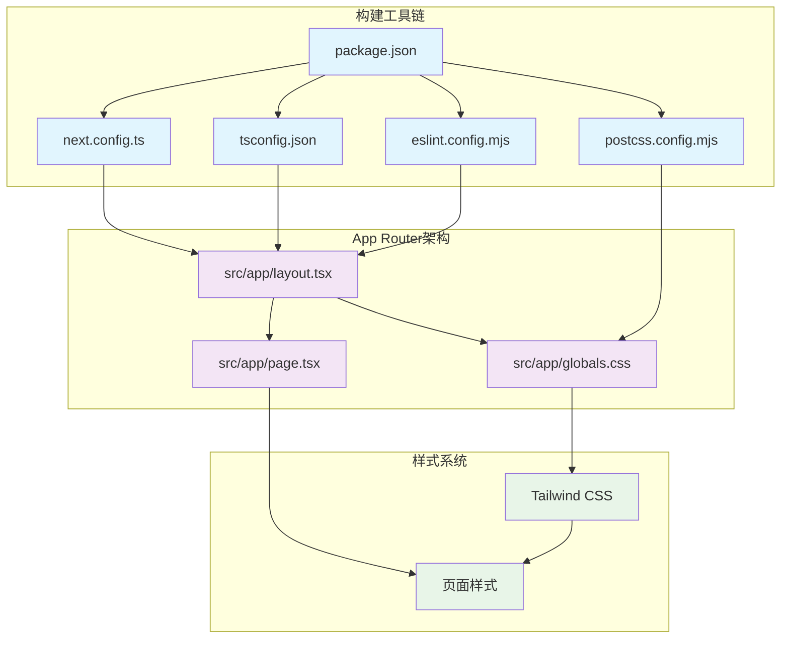
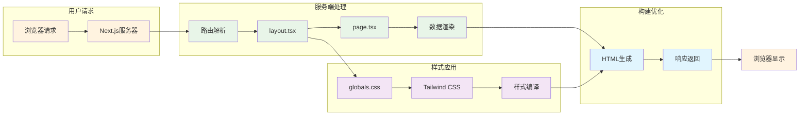

# Next.js Hello World应用技术架构描述

## 项目概述

### 基本信息
- **项目名称**: jianshaoaihuanjue
- **项目类型**: Next.js Hello World应用
- **创建方式**: 使用 `npx create-next-app` 创建
- **项目路径**: `c:\zero-to-ship-2026-01-13\jianshaoaihuanjue\`

### 技术栈配置
| 技术组件 | 版本 | 配置文件路径 | 主要功能 |
|---------|------|-------------|----------|
| Next.js | 16.1.1 | `package.json` | React全栈框架 |
| React | 19.2.3 | `package.json` | UI组件库 |
| TypeScript | ^5 | `package.json`, `tsconfig.json` | 类型安全开发 |
| Tailwind CSS | 4.0 | `package.json`, `postcss.config.mjs` | 原子化CSS框架 |
| ESLint | ^9 | `package.json`, `eslint.config.mjs` | 代码质量检查 |

### 项目结构概览
```
jianshaoaihuanjue/
├── src/
│   └── app/                    # App Router核心目录
│       ├── layout.tsx          # 根布局组件
│       ├── page.tsx            # 首页组件
│       └── globals.css         # 全局样式文件
├── package.json                # 项目依赖配置
├── next.config.ts              # Next.js构建配置
├── tsconfig.json               # TypeScript配置
├── eslint.config.mjs           # ESLint配置
└── postcss.config.mjs          # PostCSS配置
```

### 核心特性
- **App Router架构**: 基于文件系统的现代路由系统
- **服务端渲染**: 默认服务端组件渲染，优化性能
- **TypeScript支持**: 完整的类型安全开发环境
- **Tailwind CSS集成**: 现代化的原子化样式系统
- **字体优化**: 使用 `next/font` 进行自动字体优化

## App Router架构

### 核心概念
App Router是Next.js 13+引入的现代路由系统，基于React Server Components构建，取代了传统的Pages Router。

### 文件系统路由机制
- **目录结构**: `src/app/` 目录下的文件夹结构直接映射为URL路径
- **特殊文件约定**: 
  - `page.tsx` - 定义页面内容
  - `layout.tsx` - 定义共享布局结构
  - `loading.tsx` - 定义加载状态
  - `error.tsx` - 定义错误页面

### 与Pages Router的主要区别
| 特性 | App Router | Pages Router |
|------|------------|--------------|
| 目录结构 | `app/` 目录 | `pages/` 目录 |
| 默认渲染 | 服务端组件 | 客户端渲染 |
| 布局系统 | 原生嵌套布局 | 需要手动实现 |
| 数据获取 | 组件内async/await | getServerSideProps等函数 |
| 流式渲染 | 原生支持 | 不支持 |

### 核心优势
- **性能优化**: 默认服务端渲染，减少客户端JavaScript包大小
- **开发体验**: 更直观的文件系统路由，减少配置复杂性
- **功能丰富**: 原生支持嵌套布局、流式渲染、并行路由等高级特性

### 适用场景
- 新项目开发，特别是需要服务端渲染的应用
- 需要复杂布局系统的应用
- 对性能要求较高的生产环境应用

## 布局系统

### RootLayout组件
- **文件路径**: `src/app/layout.tsx`
- **功能**: 定义应用的根布局结构，包裹所有页面内容
- **特点**: 
  - 使用 `next/font/google` 进行字体优化
  - 支持元数据定义 (Metadata API)
  - 提供全局样式导入

### 核心代码分析
```typescript
// 字体优化配置
const geistSans = Geist({ variable: "--font-geist-sans", subsets: ["latin"] });
const geistMono = Geist_Mono({ variable: "--font-geist-mono", subsets: ["latin"] });

// 元数据定义
export const metadata: Metadata = {
  title: "Create Next App",
  description: "Generated by create next app",
};

// 布局组件结构
export default function RootLayout({ children }: { children: React.ReactNode }) {
  return (
    <html lang="en">
      <body className={`${geistSans.variable} ${geistMono.variable} antialiased`}>
        {children}
      </body>
    </html>
  );
}
```

### 布局系统优势
- **字体优化**: 自动字体子集化和预加载，消除布局偏移
- **元数据管理**: 集中管理SEO相关的元数据
- **样式继承**: 全局样式和字体变量在所有子组件中可用
- **嵌套支持**: 支持多级嵌套布局，实现复杂的页面结构

### 文件路径映射
| 布局类型 | 文件路径 | 功能描述 |
|---------|----------|----------|
| 根布局 | `src/app/layout.tsx` | 应用最外层布局，定义HTML结构 |
| 页面布局 | `src/app/page.tsx` | 具体页面内容布局 |
| 嵌套布局 | `src/app/[folder]/layout.tsx` | 特定路由段的布局 |

### 适用场景
- 需要统一字体和样式的应用
- 需要SEO优化的网站
- 需要复杂嵌套布局的大型应用

## 页面组件

### Home页面组件
- **文件路径**: `src/app/page.tsx`
- **功能**: 定义应用的首页内容，显示"你好，世界"
- **特点**: 
  - 使用Tailwind CSS进行样式设计
  - 支持深色/浅色模式切换
  - 响应式设计，适配不同屏幕尺寸

### 核心代码分析
```typescript
export default function Home() {
  return (
    <div className="flex min-h-screen items-center justify-center bg-zinc-50 font-sans dark:bg-black">
      <main className="flex min-h-screen w-full max-w-3xl flex-col items-center justify-center py-32 px-16 bg-white dark:bg-black">
        <h1 className="text-6xl font-bold text-black dark:text-zinc-50">
          你好，世界
        </h1>
      </main>
    </div>
  );
}
```

### 样式设计特点
- **Tailwind CSS应用**: 使用原子化CSS类快速构建UI
- **深色模式支持**: 通过 `dark:` 前缀实现主题切换
- **响应式布局**: 使用 `flex` 和 `min-h-screen` 实现居中布局
- **字体优化**: 继承布局组件中定义的字体变量

### 页面组件优势
- **简洁性**: 单一职责，专注于页面内容展示
- **性能优化**: 默认服务端渲染，无客户端JavaScript
- **可维护性**: 清晰的组件结构和样式设计
- **可扩展性**: 易于添加新的页面功能和交互

### 文件路径映射
| 页面类型 | 文件路径 | URL路径 | 功能描述 |
|---------|----------|---------|----------|
| 首页 | `src/app/page.tsx` | `/` | 应用根页面 |
| 动态路由 | `src/app/[slug]/page.tsx` | `/[slug]` | 动态参数页面 |
| 嵌套页面 | `src/app/folder/page.tsx` | `/folder` | 嵌套路由页面 |

### 适用场景
- 内容展示型页面
- 需要服务端渲染的静态页面
- 对性能要求较高的页面

## 样式系统

### Tailwind CSS集成
- **版本**: Tailwind CSS 4.0 (最新主要版本)
- **配置文件**: `postcss.config.mjs`
- **集成方式**: 通过PostCSS插件集成到构建流程中

### 全局样式配置
- **文件路径**: `src/app/globals.css`
- **功能**: 定义CSS变量和全局样式规则
- **特点**: 使用Tailwind CSS 4.0的新语法

### 核心配置分析
```css
/* PostCSS配置 (postcss.config.mjs) */
const config = {
  plugins: {
    "@tailwindcss/postcss": {},
  },
};

/* 全局样式 (globals.css) */
@import "tailwindcss";

:root {
  --background: #ffffff;
  --foreground: #171717;
}

@theme inline {
  --color-background: var(--background);
  --color-foreground: var(--foreground);
  --font-sans: var(--font-geist-sans);
  --font-mono: var(--font-geist-mono);
}

@media (prefers-color-scheme: dark) {
  :root {
    --background: #0a0a0a;
    --foreground: #ededed;
  }
}
```

### 样式系统优势
- **原子化设计**: 通过组合预定义类快速构建UI
- **性能优化**: 只打包使用到的样式，保持CSS体积最小
- **设计一致性**: 统一的间距、颜色和字体系统
- **开发效率**: 无需编写自定义CSS，减少样式冲突

### Tailwind CSS 4.0新特性
- **简化配置**: 减少配置文件复杂性
- **更好的TypeScript支持**: 改进的类型提示
- **性能提升**: 更快的构建速度和运行时性能
- **现代语法**: 使用更简洁的CSS变量和主题配置

### 文件路径映射
| 样式文件 | 文件路径 | 功能描述 |
|---------|----------|----------|
| 全局样式 | `src/app/globals.css` | 定义CSS变量和全局样式 |
| PostCSS配置 | `postcss.config.mjs` | Tailwind CSS构建配置 |
| 组件样式 | 组件内className属性 | 原子化样式应用 |

### 适用场景
- 需要快速原型开发的项目
- 团队协作项目，需要统一设计系统
- 对性能要求较高的生产环境应用
- 需要响应式设计的现代Web应用

## 开发工具链

### TypeScript配置
- **配置文件**: `tsconfig.json`
- **功能**: 提供完整的TypeScript类型检查和开发支持
- **特点**: 针对Next.js优化的TypeScript配置

### ESLint代码检查
- **配置文件**: `eslint.config.mjs`
- **功能**: 代码质量检查和规范强制执行
- **特点**: 使用Next.js官方推荐的ESLint配置

### Next.js构建配置
- **配置文件**: `next.config.ts`
- **功能**: 自定义Next.js构建和运行时行为
- **特点**: TypeScript配置，支持类型安全的配置选项

### 核心配置分析
```typescript
/* TypeScript配置 (tsconfig.json) */
{
  "compilerOptions": {
    "target": "ES2017",
    "lib": ["dom", "dom.iterable", "esnext"],
    "jsx": "react-jsx",
    "paths": {
      "@/*": ["./src/*"]
    }
  }
}

/* ESLint配置 (eslint.config.mjs) */
import { defineConfig, globalIgnores } from "eslint/config";
import nextVitals from "eslint-config-next/core-web-vitals";
import nextTs from "eslint-config-next/typescript";

/* Next.js配置 (next.config.ts) */
import type { NextConfig } from "next";
const nextConfig: NextConfig = {};
```

### 开发工具链优势
- **类型安全**: TypeScript提供编译时类型检查
- **代码质量**: ESLint确保代码规范和最佳实践
- **开发体验**: 热重载、错误提示等现代化开发功能
- **构建优化**: Next.js提供自动代码分割和优化

### 路径别名配置
- **配置位置**: `tsconfig.json` 中的 `paths` 选项
- **别名**: `@/*` 映射到 `./src/*`
- **优势**: 简化导入路径，提高代码可读性

### 文件路径映射
| 工具配置 | 文件路径 | 功能描述 |
|---------|----------|----------|
| TypeScript | `tsconfig.json` | 类型检查和编译配置 |
| ESLint | `eslint.config.mjs` | 代码质量检查配置 |
| Next.js | `next.config.ts` | 构建和运行时配置 |
| 包管理 | `package.json` | 依赖管理和脚本配置 |

### 适用场景
- 需要类型安全的大型项目
- 团队协作项目，需要统一的代码规范
- 需要自动化构建和部署的生产环境
- 追求开发效率和代码质量的项目

## 架构优劣势分析

### 架构优势

#### 1. 性能优化
- **服务端渲染**: 默认服务端组件渲染，减少客户端JavaScript包大小
- **字体优化**: `next/font` 自动字体子集化和预加载
- **代码分割**: Next.js自动进行代码分割，按需加载
- **构建优化**: 生产环境构建自动优化静态资源

#### 2. 开发体验
- **热重载**: 开发时实时更新，无需手动刷新
- **TypeScript支持**: 完整的类型安全开发环境
- **错误提示**: 清晰的编译错误和运行时错误提示
- **开发工具**: 集成ESLint、Prettier等现代化开发工具

#### 3. 可维护性
- **文件系统路由**: 直观的路由结构，易于理解和维护
- **组件化设计**: 清晰的组件职责分离
- **配置集中**: 所有配置集中在根目录，易于管理
- **代码规范**: ESLint确保代码质量和一致性

#### 4. 可扩展性
- **模块化架构**: 易于添加新功能和页面
- **插件系统**: 支持各种Next.js插件和中间件
- **API路由**: 内置API路由支持，无需额外配置
- **静态生成**: 支持静态站点生成(SSG)和增量静态再生(ISR)

### 架构劣势

#### 1. 学习曲线
- **概念复杂性**: App Router、服务端组件等新概念需要学习
- **配置复杂性**: 多个配置文件需要理解和维护
- **工具链集成**: 需要熟悉TypeScript、Tailwind CSS等工具

#### 2. 构建复杂性
- **构建时间**: 大型项目可能构建时间较长
- **依赖管理**: 需要管理多个依赖包的版本兼容性
- **部署配置**: 生产环境部署需要特定配置

#### 3. 灵活性限制
- **框架约束**: 受Next.js框架约束，某些自定义需求实现复杂
- **文件结构**: 必须遵循特定的文件结构约定
- **配置选项**: 某些高级配置需要深入理解框架原理

### 适用场景评估

#### 推荐使用场景
- **内容型网站**: 博客、文档站点、企业官网
- **电商平台**: 需要SEO优化的产品展示页面
- **仪表盘应用**: 需要服务端渲染的管理后台
- **原型开发**: 快速构建现代化Web应用原型

#### 不推荐使用场景
- **纯客户端应用**: 不需要SEO的纯交互式应用
- **超大型单体应用**: 可能需要微前端架构的应用
- **特定技术栈需求**: 需要特定非React技术栈的项目

### 技术选型建议

对于新项目，特别是需要以下特性的场景，强烈推荐使用此架构：
- 需要优秀的SEO表现
- 追求开发效率和代码质量
- 需要现代化的开发体验
- 团队具备React和TypeScript基础

对于已有项目迁移，需要评估迁移成本和团队技术栈匹配度。

## 服务端组件 vs 客户端组件

### 核心概念对比

Next.js App Router引入了React Server Components（RSC），这是理解现代Next.js架构的关键。

| 特性 | 服务端组件 (默认) | 客户端组件 (use client) |
|------|-------------------|------------------------|
| **运行环境** | 仅在服务器上执行 | 服务器预渲染 + 浏览器执行 |
| **JavaScript包** | 不发送到客户端 | 发送到客户端 |
| **数据获取** | 直接访问后端资源 | 需要通过API |
| **交互性** | 无法使用hooks和事件 | 完整的React交互功能 |
| **声明方式** | 默认，无需声明 | 文件顶部添加 "use client" |
| **性能影响** | 减少客户端包大小 | 增加客户端包大小 |

### 服务端组件特点

**文件路径**: `src/app/page.tsx` (当前项目中的所有组件都是服务端组件)

**优势**:
- **零客户端JavaScript**: 不会增加客户端包大小
- **直接数据访问**: 可以直接访问数据库、文件系统等后端资源
- **安全性**: API密钥等敏感信息不会暴露给客户端
- **SEO友好**: 完整的HTML直接发送给浏览器

**限制**:
- 不能使用 `useState`, `useEffect` 等React hooks
- 不能使用浏览器API (如 `window`, `document`)
- 不能添加事件监听器 (如 `onClick`, `onChange`)
- 不能使用React Context

**典型代码示例**:
```typescript
// src/app/page.tsx - 服务端组件 (默认)
export default function Home() {
  // 这是一个纯展示组件，没有交互
  return (
    <div className="flex min-h-screen items-center justify-center">
      <h1>你好，世界</h1>
    </div>
  );
}
```

### 客户端组件特点

**声明方式**: 在文件顶部添加 `"use client"` 指令

**使用场景**:
- 需要使用React hooks (useState, useEffect等)
- 需要处理用户交互 (点击、输入等事件)
- 需要使用浏览器API
- 需要使用第三方交互式库

**示例代码**:
```typescript
// 如果需要添加交互功能，可以创建 src/app/counter.tsx
"use client"; // 客户端组件声明

import { useState } from "react";

export default function Counter() {
  const [count, setCount] = useState(0);

  return (
    <div>
      <p>Count: {count}</p>
      <button onClick={() => setCount(count + 1)}>
        Increment
      </button>
    </div>
  );
}
```

### 组件混合使用策略

**最佳实践**: 服务端组件为主，客户端组件按需使用

```typescript
// src/app/page.tsx - 服务端组件
import Counter from "./counter"; // 客户端组件

export default function Home() {
  // 服务端组件可以包含客户端组件
  return (
    <div>
      <h1>你好，世界</h1>
      <Counter /> {/* 客户端组件嵌入 */}
    </div>
  );
}
```

**关键原则**:
1. **服务端组件可以导入客户端组件**
2. **客户端组件不能导入服务端组件**（但可以通过props.children传递）
3. **尽可能多用服务端组件**，减少客户端JavaScript

### 文件路径映射

| 组件类型 | 声明方式 | 示例路径 |
|---------|---------|----------|
| 服务端组件 | 默认（无需声明） | `src/app/page.tsx` |
| 客户端组件 | `"use client"` | `src/app/counter.tsx` (示例) |
| 共享组件 | 根据需要选择 | `src/components/**/*.tsx` |

### 调试技巧

**识别组件类型**:
- 查看文件顶部是否有 `"use client"`
- 如果没有，默认就是服务端组件
- 使用 `console.log` 时：
  - 服务端组件的日志出现在终端
  - 客户端组件的日志出现在浏览器控制台

## 数据获取方式

### App Router数据获取模式

Next.js App Router彻底简化了数据获取流程，不再需要 `getServerSideProps` 或 `getStaticProps`。

### 服务端组件中的数据获取

**核心特点**: 直接使用 `async/await` 语法

```typescript
// src/app/posts/page.tsx - 示例：博客文章列表页
async function getPosts() {
  // 可以直接访问数据库、文件系统或调用API
  const res = await fetch('https://api.example.com/posts', {
    // Next.js 16 默认缓存策略
    cache: 'force-cache' // 等同于旧版的 getStaticProps
  });
  return res.json();
}

export default async function PostsPage() {
  const posts = await getPosts(); // 直接await

  return (
    <div>
      {posts.map(post => (
        <article key={post.id}>{post.title}</article>
      ))}
    </div>
  );
}
```

### 缓存控制策略

| 缓存策略 | 配置选项 | 等同于旧版 | 使用场景 |
|---------|---------|-----------|----------|
| 完全缓存 | `cache: 'force-cache'` | getStaticProps | 静态内容 |
| 不缓存 | `cache: 'no-store'` | getServerSideProps | 动态内容 |
| 定时重新验证 | `next: { revalidate: 60 }` | ISR (增量静态再生) | 定期更新的内容 |

### 并行数据获取

```typescript
// src/app/dashboard/page.tsx - 示例：仪表盘
async function getUser() {
  const res = await fetch('https://api.example.com/user');
  return res.json();
}

async function getStats() {
  const res = await fetch('https://api.example.com/stats');
  return res.json();
}

export default async function Dashboard() {
  // 并行获取多个数据源
  const [user, stats] = await Promise.all([
    getUser(),
    getStats()
  ]);

  return (
    <div>
      <h1>Welcome, {user.name}</h1>
      <p>Total Views: {stats.views}</p>
    </div>
  );
}
```

### 客户端组件中的数据获取

**使用场景**: 需要用户交互后获取数据

```typescript
// src/app/search.tsx - 示例：搜索组件
"use client";

import { useState, useEffect } from "react";

export default function Search() {
  const [query, setQuery] = useState("");
  const [results, setResults] = useState([]);

  useEffect(() => {
    if (query) {
      fetch(`/api/search?q=${query}`)
        .then(res => res.json())
        .then(data => setResults(data));
    }
  }, [query]);

  return (
    <div>
      <input
        value={query}
        onChange={(e) => setQuery(e.target.value)}
      />
      {results.map(item => <div key={item.id}>{item.title}</div>)}
    </div>
  );
}
```

### 数据获取最佳实践

1. **优先使用服务端组件获取数据**: 更快、更安全
2. **客户端数据获取用于交互场景**: 搜索、筛选、分页等
3. **使用缓存策略优化性能**: 根据内容更新频率选择合适的缓存
4. **错误处理**: 使用 `error.tsx` 处理数据获取错误

## 开发工作流实践

### 日常开发命令

**文件路径**: `package.json` - scripts 部分

| 命令 | 作用 | 使用场景 |
|------|------|----------|
| `npm run dev` | 启动开发服务器 (端口3000) | 日常开发 |
| `npm run build` | 生产环境构建 | 部署前构建 |
| `npm run start` | 启动生产服务器 | 本地预览生产版本 |
| `npm run lint` | 运行ESLint检查 | 代码质量检查 |

### 开发工作流程

#### 1. 启动开发环境
```bash
# 在项目根目录执行
npm run dev
```
**特点**:
- 热重载: 代码修改后自动刷新浏览器
- 快速刷新: 保留组件状态
- 错误提示: 浏览器中显示详细错误信息
- 访问地址: http://localhost:3000

#### 2. 开发新功能
```bash
# 典型开发流程
1. 在 src/app/ 目录创建新的路由文件夹
2. 添加 page.tsx 定义页面
3. (可选) 添加 layout.tsx 定义布局
4. (可选) 添加 loading.tsx 定义加载状态
5. (可选) 添加 error.tsx 定义错误处理
```

**文件系统路由示例**:
```
src/app/
├── page.tsx              → 访问路径: /
├── about/
│   └── page.tsx          → 访问路径: /about
├── blog/
│   ├── page.tsx          → 访问路径: /blog
│   └── [slug]/
│       └── page.tsx      → 访问路径: /blog/任意参数
```

#### 3. 代码质量检查
```bash
# 运行ESLint检查
npm run lint

# 如果有错误，修复后再提交代码
```

#### 4. 构建和部署
```bash
# 构建生产版本
npm run build

# 本地预览生产版本
npm run start
```

**构建输出说明**:
- `.next/` 目录包含构建产物
- 自动进行代码分割和优化
- 生成静态HTML和优化的JavaScript

### 开发环境配置

**TypeScript配置**: `tsconfig.json`
- 路径别名: `@/*` 映射到 `./src/*`
- 使用示例: `import Component from '@/components/Component'`

**环境变量配置**:
```bash
# 创建 .env.local 文件（如需要）
NEXT_PUBLIC_API_URL=https://api.example.com  # 客户端可访问
DATABASE_URL=postgresql://...                 # 仅服务端可访问
```

### 调试技巧

#### 1. 查看编译错误
- 终端显示构建错误
- 浏览器显示运行时错误覆盖层

#### 2. 区分服务端/客户端日志
```typescript
// 服务端组件
console.log("这条日志在终端显示");

// 客户端组件
"use client";
console.log("这条日志在浏览器控制台显示");
```

#### 3. 性能分析
```bash
# 启动时显示构建分析
npm run build

# 查看各页面的大小和加载时间
```

### 常见问题和解决方案

#### 问题1: 端口3000已被占用
```bash
# 使用不同端口启动
PORT=3001 npm run dev
```

#### 问题2: 样式不生效
- 检查 `globals.css` 是否在 `layout.tsx` 中导入
- 检查 Tailwind 类名是否正确
- 清除 `.next` 缓存: 删除 `.next/` 文件夹后重启

#### 问题3: 类型错误
```bash
# 重新生成TypeScript类型
rm -rf .next
npm run dev
```

#### 问题4: "use client" 使用时机
- 如果组件不需要交互，保持为服务端组件
- 只在需要hooks、事件处理或浏览器API时添加 "use client"

### 文件监视和自动重载

开发服务器会自动监视以下文件变化：
- `src/app/**/*.tsx` - 页面和布局组件
- `src/app/globals.css` - 全局样式
- `next.config.ts` - Next.js配置（需重启）
- `tsconfig.json` - TypeScript配置（需重启）
- `tailwind.config.*` - Tailwind配置（需重启）

### 生产部署建议

1. **Vercel部署**（推荐）:
   - 原生支持Next.js
   - 自动CI/CD
   - 全球CDN加速

2. **Docker部署**:
   ```bash
   npm run build
   npm run start  # 需要Node.js环境
   ```

3. **静态导出**（如果适用）:
   ```javascript
   // next.config.ts
   const config: NextConfig = {
     output: 'export', // 生成纯静态HTML
   };
   ```

## 组件关系图

### 整体架构关系图



### 数据流关系图



### 文件依赖关系说明

1. **配置层依赖**:
   - `package.json` 是所有配置的基础
   - 其他配置文件都依赖于包管理配置

2. **组件层依赖**:
   - `layout.tsx` 是应用的根组件
   - `page.tsx` 依赖于布局组件提供的上下文
   - `globals.css` 被布局组件导入，提供全局样式

3. **样式系统依赖**:
   - PostCSS配置驱动Tailwind CSS编译
   - 全局样式定义CSS变量和基础样式
   - 页面组件通过className应用原子化样式

4. **构建流程**:
   - 开发时：热重载和实时编译
   - 构建时：类型检查、代码优化、资源压缩
   - 运行时：服务端渲染和客户端水合